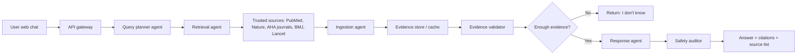

# Clinical Evidence RAG Architecture

## Goal

Build a web chat system for anyone who needs medical evidence answers from trusted medical literature. If retrieved evidence is weak or missing, the system must say "I don't know" instead of hallucinating.

## User-Facing Contract

- Answers should be concise, but not capped to a fixed word count.
- Every answer includes the papers or data sources used.
- Sources are restricted to reliable medical databases and journals: PubMed, Nature journals, American Heart Association journals, BMJ journals, and The Lancet journals.
- Diagnostic answers are informational only and must be backed by citations.

## Agentic Workflow

1. Query understanding agent
   - Classifies the user query as treatment, drug safety, diagnosis, symptom, or research.
   - Extracts keywords and detects vague symptom-only prompts.

2. Clarification agent
   - Asks for more detail when a query is too vague for reliable retrieval.

3. Clinical query rewriter agent
   - Converts the free-text question into a retrieval-oriented clinical query.
   - Rewrites common clinical cases such as HFrEF therapy, acute stroke intervention, and metformin-B12 evidence.
   - If `GEMINI_API_KEY` is configured, Gemini can rewrite the query before trusted-source API calls. It is instructed to return only a PubMed query, never a medical answer.

4. Retrieval agent
   - Searches PubMed through NCBI E-utilities.
   - Runs separate trusted-source searches for PubMed, Nature journals, American Heart Association journals, BMJ journals, and The Lancet journals.
   - Uses journal filters for source-specific retrieval rather than uncontrolled web search.
   - Future extension: add licensed full-text APIs from Nature, BMJ, Lancet, and AHA when available.

5. Ingestion agent
   - Fetches article metadata and abstracts.
   - Normalizes title, journal, year, PMID, abstract, and URL.

6. Trusted source filter agent
   - Rejects sources with no abstract or weak query overlap.
   - Prefers guidelines, reviews, clinical trials, and trusted journals.

7. Relevance ranking agent
   - Scores evidence using overlap, trusted-source signal, clinical relevance, source diversity, and evidence count.

8. Hallucination guard agent
   - Requires enough ranked evidence before allowing a generated answer.
   - Forces "I don't know" when the threshold is not met.

9. Response generation agent
   - Generates the answer using only accepted evidence.
   - Uses Gemini first when `GEMINI_API_KEY` is configured, with retrieved papers supplied as the only context.
   - Uses temperature 0 when an LLM API key is provided.
   - Falls back to extractive summaries if no LLM key is configured.

10. Citation agent
   - Enforces citations and traceability for accepted evidence.
   - Returns citations and workflow trace with every response.

## High-Level System Design



## Prototype Notes

This folder contains a runnable Python prototype:

```powershell
python server.py
```

Open:

```text
http://127.0.0.1:8000
```

Optional environment variables:

- `GEMINI_API_KEY`: enables Gemini query rewriting and grounded answer generation.
- `GEMINI_MODEL`: defaults to `gemini-1.5-flash`.
- `OPENAI_API_KEY`: enables LLM synthesis grounded only in retrieved evidence.
- `OPENAI_MODEL`: defaults to `gpt-4.1-mini`.
- `NCBI_EMAIL`: recommended by NCBI for E-utilities requests.

Without an OpenAI key, the app still retrieves trusted indexed evidence and returns extractive citation-backed summaries.
